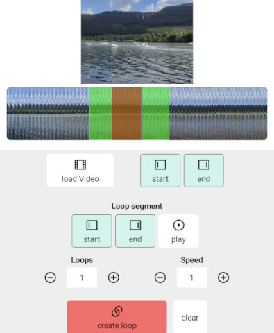

# Titanium FFMPEG module for Android and iOS




This module allows you to run ffmpeg commands inside your Titanium SDK app. It is using https://github.com/arthenica/ffmpeg-kit "min version".

You can convert video files, add watermarks, cut and merge clips and much more.

## Methods

* info()
* run()

## Example
```js
const ffmpeg = require("ti.ffmpeg");
ffmpeg.info({
	options: "-encoders"
});

ffmpeg.addEventListener("progress", function(e) {});


var file = Ti.Filesystem.getFile(Ti.Filesystem.applicationDataDirectory, "video.mp4");
var file_out = Ti.Filesystem.getFile(Ti.Filesystem.applicationDataDirectory, "video_out.mp4");
var file_watermark = Ti.Filesystem.getFile(Ti.Filesystem.applicationDataDirectory, "watermark.png");

ffmpeg.run({
	input: file,
	output: file_out,
	watermark: file_watermark,
	options: "-y -b:v 5M -preset ultrafast -g 1 -filter_complex '[0]scale=512:-1' -an",
	success: function(e) {
		// e.file
		// e.duration
	},
	error: function(e) {}
})
```

also check `example/app.js` for another example app.

## Author

- Android: Michael Gangolf ([@MichaelGangolf](https://twitter.com/MichaelGangolf) / [Web](http://migaweb.de)) <span class="badge-buymeacoffee"><a href="https://www.buymeacoffee.com/miga" title="donate"></a></span>
- iOS: Christian Clare ([@narbs](https://github.com/narbs) / [Tambit Software LLC](https://www.groundhum.com/portfolio))

## Need an Titanium iOS module?

Get it contact with Christian Clare ([@narbs](https://github.com/narbs) / [Tambit Software LLC](https://www.groundhum.com/portfolio)). He offers Titanium iOS module development as well as native iOS development.
